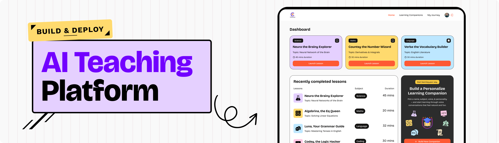

<div align="center">
  
  <h1>Converso</h1>
  <p><strong>Real-Time Conversational AI Teaching Platform</strong></p>

  <p>
    Master any subject through interactive, voice-first conversations with personalized AI learning companions.
  </p>

  <p>
    <a href="#features">Features</a> •
    <a href="#tech-stack">Tech Stack</a> •
    <a href="#getting-started">Getting Started</a> •
    <a href="#database-schema">Database Schema</a> •
    <a href="#design-system">Design System</a> •
    <a href="#project-structure">Project Structure</a>
  </p>

  <p>
    
    
    
    
    
    
    
  </p>
</div>

---

<div align="center">
  
</div>

---

## 📖 Overview

**Converso** transforms passive online education into an engaging, voice-first learning experience. Instead of reading walls of text or watching static videos, students and lifelong learners hold real-time, two-way spoken dialogues with custom AI teaching companions.

Whether practicing spoken conversational English, working through calculus derivatives, understanding computer science architectures, or analyzing historical events, Converso companions adapt to your pace, explain complex concepts simply, and keep track of your learning journey.

---

## ✨ Features

- 🎙️ **Real-Time Spoken Conversations**: Instantaneous low-latency voice interaction powered by Vapi AI. Talk freely, ask follow-up questions, and receive spoken responses in real time.
- 🛠️ **Custom Companion Studio**: Build your own AI companion from scratch:
  - Choose subject & topic focus
  - Pick custom voice personalities (Male / Female, Formal / Casual)
  - Configure target lesson durations
- 🎨 **Neo-Brutalist Design System**: High-contrast, playful aesthetic built with bold black borders, rounded pills (`rounded-4xl`), vibrant primary orange accents (`#FE5933`), and distinct subject pastel color codes.
- 📊 **Learning Journey & History**:
  - Live session duration tracking
  - Lesson counters and companion tracking
  - **Dynamic Empty-State Experience**: When no prior sessions exist, an interactive launchpad showcases popular subject starter chips and one-click actions instead of an empty table.
- 🔍 **Subject Exploration & Search**: Filter and search through companion catalogs across Mathematics, Coding, Science, Languages, History, and Economics.
- 🔐 **Authentication & Profiles**: Seamless user sign-in and profile synchronization powered by Clerk.
- 💳 **Plan & Usage Limiting**: Configurable companion creation limits with Clerk subscription tiers.
- 📱 **Fully Responsive Layout**: Thoughtfully crafted for desktop, tablet, and mobile displays, complete with sticky footer navigation.

---

## 🛠️ Tech Stack

| Domain | Technology | Description |
| :--- | :--- | :--- |
| **Framework** | [Next.js 16](https://nextjs.org/) | App Router, Turbopack, React Server Components & Server Actions |
| **UI Library** | [React 19](https://react.dev/) | Latest concurrent React features |
| **Language** | [TypeScript](https://www.typescriptlang.org/) | Strict type safety across components and actions |
| **Styling** | [Tailwind CSS v4](https://tailwindcss.com/) | Modern CSS tokens, utility classes, and custom animation utilities |
| **Voice AI** | [Vapi Web SDK](https://vapi.ai/) | Real-time WebRTC audio streaming, speech recognition, and TTS |
| **Authentication** | [Clerk](https://clerk.com/) | Secure authentication, middleware, and user management |
| **Database** | [Supabase](https://supabase.com/) | PostgreSQL database with Row Level Security (RLS) |
| **Icons & Assets** | [Lucide React](https://lucide.dev/) | Clean, accessible vector iconography |
| **Animations** | [Lottie React](https://github.com/Gamote/lottie-react) | Lightweight vector animations for audio and tutor avatars |

---

## 🎨 Design System & Subject Colors

Converso uses a recognizable color-coding system for each academic discipline:

| Subject | Pastel Color Code | Preview | Slug |
| :--- | :--- | :---: | :--- |
| **Science** | `#E5D0FF` | 🟪 | `science` |
| **Maths** | `#FFDA6E` | 🟨 | `maths` |
| **Language** | `#BDE7FF` | 🟦 | `language` |
| **Coding** | `#FFC8E4` | 🌸 | `coding` |
| **History** | `#FFECC8` | 🟧 | `history` |
| **Economics** | `#C8FFDF` | 🟩 | `economics` |

- **Primary Accent**: `#FE5933` (Warm Energetic Orange)
- **Charcoal CTA**: `#2c2c2c`
- **Gold Badge**: `#fccc41`
- **Typography**: [Bricolage Grotesque](https://fonts.google.com/specimen/Bricolage+Grotesque) & Geist Sans

---

## 🚀 Getting Started

Follow these steps to run Converso locally on your machine.

### Prerequisites

- **Node.js** 18.18 or higher (Node 20+ recommended)
- **npm**, **pnpm**, or **yarn**
- Accounts for:
  - [Clerk](https://clerk.com/) (Auth keys)
  - [Supabase](https://supabase.com/) (Postgres DB)
  - [Vapi AI](https://vapi.ai/) (Voice API key)

### 1. Clone the Repository

```bash
git clone https://github.com/your-username/converso.git
cd converso
```

### 2. Install Dependencies

```bash
npm install
```

### 3. Configure Environment Variables

Create a `.env.local` file in the root directory by copying the sample:

```bash
cp .env.example .env.local
```

Fill in your respective API keys:

```env
# Clerk Authentication
NEXT_PUBLIC_CLERK_PUBLISHABLE_KEY=pk_test_...
CLERK_SECRET_KEY=sk_test_...
NEXT_PUBLIC_CLERK_SIGN_IN_URL=/sign-in
NEXT_PUBLIC_CLERK_SIGN_UP_URL=/sign-up
NEXT_PUBLIC_CLERK_SIGN_IN_FALLBACK_REDIRECT_URL=/
NEXT_PUBLIC_CLERK_SIGN_UP_FALLBACK_REDIRECT_URL=/

# Supabase Database
NEXT_PUBLIC_SUPABASE_URL=https://your-project-id.supabase.co
NEXT_PUBLIC_SUPABASE_PUBLISHABLE_KEY=sb_publishable_...

# Vapi AI Voice Platform
NEXT_PUBLIC_VAPI_PUBLIC_KEY=your-vapi-public-key
```

### 4. Setup the Database Schema

Run the following SQL statements in your Supabase SQL Editor:

```sql
-- Companions Table
create table public."Companion" (
  id uuid default gen_random_uuid() primary key,
  created_at timestamp with time zone default timezone('utc'::text, now()) not null,
  name text not null,
  subject text not null,
  topic text not null,
  voice text not null,
  style text not null,
  duration integer default 15,
  author text not null
);

-- Session History Table
create table public.session_history (
  id uuid default gen_random_uuid() primary key,
  created_at timestamp with time zone default timezone('utc'::text, now()) not null,
  user_id text not null,
  companion_id uuid references public."Companion"(id) on delete cascade
);
```

### 5. Start the Development Server

```bash
npm run dev
```

Open [http://localhost:3000](http://localhost:3000) in your browser to start exploring Converso.

---

## 📁 Project Structure

```text
├── app/
│   ├── companion/
│   │   ├── [id]/page.tsx      # Active live voice companion session
│   │   ├── new/page.tsx       # Companion creation studio
│   │   └── page.tsx           # Companion catalog & search directory
│   ├── profile/page.tsx       # User journey, stats, and session accordions
│   ├── sign-in/[[...sign-in]] # Clerk Sign-In route
│   ├── sign-up/[[...sign-up]] # Clerk Sign-Up route
│   ├── subscription/page.tsx  # Pricing plans & tier limits
│   ├── globals.css            # Tailwind v4 theme, design tokens & classes
│   ├── layout.tsx             # Root layout (ClerkProvider, Navbar, Footer)
│   └── page.tsx               # Homepage (Popular companions, Sessions, CTA)
├── components/
│   ├── Companioncard.tsx      # Neo-brutalist companion card component
│   ├── Companionform.tsx      # Multi-step creation form for companions
│   ├── Companionlist.tsx      # Recent sessions list with interactive zero-state
│   ├── CompanionComponent.tsx # Voice session player & speech transcript
│   ├── Cta.tsx                # Homepage call-to-action banner
│   ├── Footer.tsx             # Design system footer (homepage banner, links)
│   ├── Navbar.tsx             # Global navigation bar & user button
│   ├── SearchFilter.tsx       # Subject dropdown filter
│   ├── SearchInput.tsx        # Topic text search field
│   └── ui/                    # Reusable shadcn UI components
├── constants/
│   └── index.ts               # Subjects, colors, voice configurations
├── lib/
│   ├── actions/
│   │   └── companion.action.ts # Next.js server actions (Supabase queries)
│   └── utils.ts               # Helper utilities & class merging (cn)
├── public/
│   ├── icons/                 # Subject and UI SVG icons
│   ├── images/                # Logos, illustrations, and banners
│   └── readme/                # Documentation media assets
├── types/
│   ├── index.d.ts             # Companion, User, and Session TypeScript types
│   ├── supabase.ts            # Authenticated Supabase client factory
│   └── vapi.d.ts              # Vapi voice engine typings
├── .env.example               # Environment variables template
├── next.config.ts             # Next.js configuration
├── package.json               # Dependencies and scripts
└── tsconfig.json              # TypeScript configuration
```

---

## ⚡ Available Scripts

| Command | Description |
| :--- | :--- |
| `npm run dev` | Runs the Next.js development server with Turbopack |
| `npm run build` | Compiles the production build |
| `npm run start` | Starts the production server |
| `npm run lint` | Runs ESLint to check for code quality and syntax issues |

---

## 🤝 Contributing

Contributions are welcome! Please follow these steps:

1. Fork the repository.
2. Create your feature branch (`git checkout -b feature/amazing-feature`).
3. Commit your changes (`git commit -m 'Add some amazing feature'`).
4. Push to the branch (`git push origin feature/amazing-feature`).
5. Open a Pull Request.

---

## 📄 License

This project is licensed under the MIT License — see the [LICENSE](LICENSE) file for details.

<div align="center">
  <sub>Built with ❤️ using Next.js, Clerk, Supabase, and Vapi AI.</sub>
</div>
